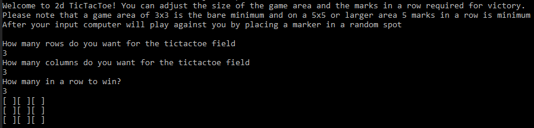

<br />
<p align="center">

  <h3 align="center">TicTacToe</h3>

  <p align="center">
    Command line TicTacToe game against computer
    <br />
    <a href="https://github.com/Rhaxis/TicTacToe"><strong>Explore the docs »</strong></a>
    <br />
    <br />
</p>


<!-- TABLE OF CONTENTS -->
<details open="open">
  <summary><h2 style="display: inline-block">Table of Contents</h2></summary>
  <ol>
    <li>
      <a href="#about-the-project">About The Project</a>
      <ul>
        <li><a href="#built-with">Built With</a></li>
      </ul>
    </li>
    <li>
      <a href="#getting-started">Getting Started</a>
      <ul>
        <li><a href="#prerequisites">Prerequisites</a></li>
        <li><a href="#installation">Installation</a></li>
      </ul>
    </li>
    <li><a href="#usage">Usage</a></li>
    <li><a href="#contact">Contact</a></li>
  </ol>
</details>


<!-- ABOUT THE PROJECT -->
## About The Project


The game was done during my first year in school for the basics of programming course, which consisted of Java. It has a simple AI that will place a random marker after the player.
It is possible to adjust the size of the gamefield and how many marks in a row are required.

### Built With

* [Java](https://www.java.com/en/)


<!-- GETTING STARTED -->
## Getting Started

To get a local copy up and running follow these simple steps.

### Prerequisites

* Java
  ```sh
  https://www.java.com/en/download/
  ```

### Installation

1. Clone the repo
   ```sh
   git clone https://github.com/Rhaxis/TicTacToe.git
   ```
2. Compile
   ```sh
   javac src/TicTacToeGame.java
   ```
3. Run
   ```sh
   java -cp src TicTacToeGame
   ```


<!-- USAGE EXAMPLES -->
## Usage

After running the game the player will get instructions on how to set the size of the gamefield and the marks in a row to win. Input is given on the command line with just numbers and submit via return. To close down the game simply press ctrl + c or close the command line interface.


<!-- CONTACT -->
## Contact

Ville Ekholm - ville.ekholm88@gmail.com

Project Link: [https://github.com/Rhaxis/TicTacToe](https://github.com/Rhaxis/TicTacToe)
